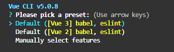
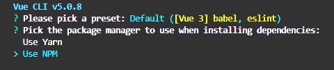
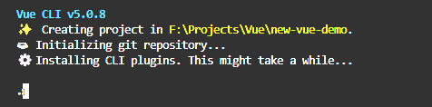
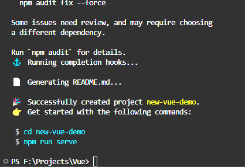

# Vueフレームワーク応用のAzure Static Web Apps
> ## **目次**
> - [はじめに](#はじめに)  
>   - [Visual Studio Code](#visual-studio-code)
>   - [Git](#git)
>   - [Node.js](#nodejs)
>   - [Vue Cli](#vue-cli)
> - [Vueを使用するStatic Web Appsの作成](#vueを使用するstatic-web-appsの作成)


## **はじめに**
### **Visual Studio Code**
- Visual Studio Codeをインストール  
    [](https://code.visualstudio.com/sha/download?build=stable&os=win32-x64-user)  
- VS Codeの使い方　[VS Codeドキュメント](https://code.visualstudio.com/docs)  
VS Codeエクステンションは後ほど追加説明  
    > **ほかの開発ツールの使用も可能ですが、VS Codeは無料かつ軽量のため推奨**

### **Git**
- Gitをインストール [Gitインストーラ](https://github.com/git-for-windows/git/releases/download/v2.50.0.windows.2/Git-2.50.0.2-64-bit.exe ) 

### **Node.js**
- nvmをインストール [nvm for windows](https://github.com/coreybutler/nvm-windows/releases)  
    > node.jsのバージョン管理ツール。linux 環境はこちらのページに参考 [nvm](https://github.com/nvm-sh/nvm?tab=readme-ov-file#installing-and-updating)
    - インストール成功のあと、システム環境変数は以下のキーが入っている。もし入っていなかったの場合は手動で追加。
    ```
    NVM_HOME=[nvmのインストールフォルダ]
    NVM_SYMLINK=[Node.jsの参照フォルダ]
    PATH+=%NVM_HOME%;%NVM_SYMLINK%
    ```
    > WindowsのPowerShellを使っているの場合、管理員権限で起動する必要があります。  
    > その上、npmのPowerShellスクリプト実行するための権限を与える必要があります。下記のコマンドを実行する。
    > ```
    > Set-ExecutionPolicy -ExecutionPolicy RemoteSigned -Scope LocalMachine
    > ```  
    任意のターミナルでnvmのバージョンチェック出来れば、インストールは成功です。  
    ``` 
    nvm -v 
    ```  
- Node.jsをインストール  
    nvmインストール成功のあと、下記のコマンドでNode.jsのLTSバージョンをインストール  
    ```
    nvm install lts
    ```  
    > 他のバージョンが必要の場合は nvm install \<version\> コマンド  
    任意のターミナルでnodeのバージョンチェック出来れば、インストールは成功です。
    ```
    node -v
    ```
### **Vue Cli**   
> Node.jsがインストール成功すれば、npmというパッケージマネージャでインストールすることができる  
> yarnを使うことも可(yarnのインストールが必要)  

下記のコマンドはnpmを使ってvue cliをインストール(-gはグローバル)。  
```
npm install -g @vue/cli
```
任意のターミナルでnodeのバージョンチェック出来れば、インストールは成功です。  
```
vue --version
```
## **Vueを使用するStatic Web Appsの作成** 
> :warning:**注意！！** このプロジェクトはデモのため、GitHubを使っています。実際のプロジェクトはAzure DevOpsのAzure Reposを使います。
### **前提**
- 既にAzure static web appsの料金プランを加入したこと
- アカウントがAzure DevOps組織加入したこと  

### **手順**
> これはあくまでも一つの作成手法を紹介。プロジェクトに適宜の手法を使いましょう。
1. ローカルフォルダでVue Cliコマンドを使い、テンプレートプロジェクトを作成  
```
vue create <project名>
```
下記は十字キーで選択  

Vue 3を選択  

NPMを選択  

完成まで待つ  

完成  

***

## Project setup
```
npm install
```

### Compiles and hot-reloads for development
```
npm run serve
```

### Compiles and minifies for production
```
npm run build
```

### Lints and fixes files
```
npm run lint
```

### Customize configuration
See [Configuration Reference](https://cli.vuejs.org/config/).
